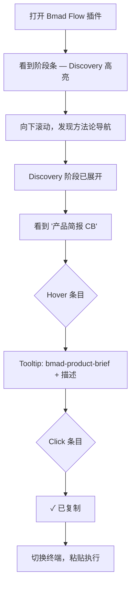
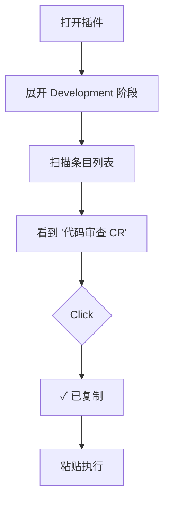
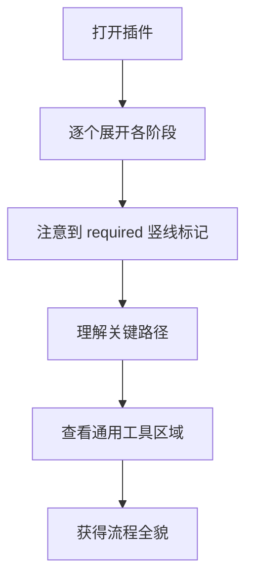
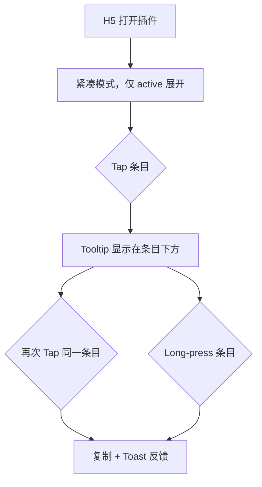

# UX Design Specification bmad-flow

**Author:** Engineer
**Date:** 2026-04-26

---

## Executive Summary

### Project Vision

Bmad Flow V2 的目标是将插件从"流程状态看板"升级为"认知工作台与操作引导平台"。它不仅帮助用户知道自己当前处于 BMad 流程的哪个阶段，还要在同一界面中清晰展示当前和全局可用的方法、工作流、智能体与命令，从而降低学习门槛并缩短执行路径。新功能应作为现有 Bmad Flow 体验的自然扩展存在，而不是另起一套独立产品。

### Target Users

1. 刚接触 BMad 的新手开发者，需要明确的阶段引导和低门槛的命令发现方式。
2. 熟悉 BMad 的资深开发者，需要快速定位具体 skill 并立即复制执行。
3. 技术负责人或项目负责人，需要在插件中快速理解完整流程结构、关键路径与必需环节。
4. 在 H5、iPad 或触屏环境中使用插件的用户，需要适配 tap / long-press 的交互方式。

### Key Design Challenges

1. 方法论条目数量较多（40+），必须控制信息密度，避免让导航本身成为认知负担。
2. 同一套功能需要兼容桌面端与触屏端，两者在详情查看和复制动作上的交互语义不同。
3. 用户能力跨度较大，既要帮助新手理解流程，也要支持老手快速操作。
4. 新的导航区域必须嵌入现有 V1 架构，作为增强而非替代，不能在视觉权重和心智结构上喧宾夺主。

### Design Opportunities

1. 将传统的外部方法论文档转化为 IDE 内的上下文感知导航，是本产品最强的 UX 差异化机会。
2. 通过当前 active phase 默认展开，可以把"现在最相关的操作"直接送到用户面前，减少搜索成本。
3. 通过 menu code、required 标记、tooltip 和复制反馈的组合，可以同时提升扫描效率与可理解性。
4. 如果桌面端与 H5 端都能形成自然连续的操作体验，产品将明显优于静态文档和 CLI `--help` 式导航。

### Experience Consistency Principle

方法论导航必须与现有 Bmad Flow 风格保持一致。它是对当前界面的自然延伸，而不是独立的第二界面。具体含义：

1. **视觉一致**：延续现有阶段条、建议卡片、Sprint 面板的密度、间距、层级与配色，新区域的视觉权重不得高于现有 V1 区块。
2. **交互一致**：tooltip、复制反馈、toast 等沿用现有"轻提示、轻反馈、低打扰"的语义，不引入新的成功/失败语言。
3. **主题与国际化一致**：复用现有 `tc()` 主题令牌与 i18n 体系，不为方法论导航单独建立视觉或文案系统。
4. **结构一致**：作为 append-only enhancement 嵌入页面下方，不重排或弱化现有 V1 区块。
5. **失败语义一致**：加载或解析失败时静默降级，不影响阶段条、建议卡片与 Sprint 面板的稳定性。

## Core User Experience

### Defining Experience

用户在 Bmad Flow 侧边栏中最频繁的核心动作是：**在当前阶段下找到目标操作并复制命令**。这个"发现 → 理解 → 复制"的三步闭环必须在 5 秒内完成，是整个 V2 UX 的核心度量。

### Platform Strategy

- 主平台：CloudCLI UI 侧边栏（桌面端浏览器 DOM 环境）
- 次平台：H5 / iPad 触屏环境（同一份代码，通过 interaction adapter 切换）
- 约束：纯 DOM 操作，禁止引入 React/Vue 等框架；前后端通过本地 HTTP + `api.rpc()` 通信
- 离线：不需要，数据来源为本地文件系统

### Effortless Interactions

- 当前活跃阶段自动展开，用户无需手动寻找
- 条目 hover 即可预览全称和描述，无需额外点击
- 单击即复制，反馈 1.5 秒自动消退，不打断浏览
- 通用工具始终可见，不需要展开操作

### Critical Success Moments

1. 用户首次看到方法论导航时，立刻理解"这是按阶段组织的操作列表"
2. 用户 hover 某条目时，tooltip 出现的速度和位置让人感到"刚好在需要的地方"
3. 用户点击复制后，"✓ 已复制"反馈让人确信操作已完成
4. 方法论数据加载失败时，用户完全不会注意到——V1 功能照常运行

### Experience Principles

1. **上下文优先**：始终围绕用户当前所处阶段组织信息
2. **零学习成本**：交互模式与 V1 完全一致，不引入新的操作范式
3. **渐进披露**：折叠/展开控制信息密度，避免一次性展示 40+ 条目
4. **静默降级**：新功能的任何失败都不影响既有体验

## Desired Emotional Response

### Primary Emotional Goals

- **高效感**：用户应感到"我能在几秒内找到并执行任何 BMad 命令"
- **掌控感**：用户应感到"我对整个方法论流程了然于胸"
- **信任感**：用户应感到"这个工具稳定可靠，不会给我添麻烦"

### Emotional Journey Mapping

| 阶段 | 期望情感 | 设计支撑 |
|------|----------|----------|
| 首次发现导航 | 好奇 → 理解 | 清晰的阶段分组 + 当前阶段高亮 |
| 浏览条目 | 从容 → 自信 | 折叠控制密度 + tooltip 补充细节 |
| 复制命令 | 确认 → 满足 | 即时反馈 "✓ 已复制" |
| 遇到加载失败 | 无感知 | 静默降级，V1 不受影响 |
| 再次使用 | 熟悉 → 高效 | 一致的交互模式，无需重新学习 |

### Micro-Emotions

- 信心 > 困惑：每个条目的 `[菜单代码] + 显示名称` 格式让用户一眼识别
- 成就 > 挫败：复制成功率目标 > 95%，失败时提供手动复制回退
- 平静 > 焦虑：新区域不抢夺视觉焦点，不产生"又多了一堆东西要学"的压力

### Emotional Design Principles

1. 用"补充信息"的姿态出现，而不是"强制学习"的姿态
2. 所有反馈都是轻量级的：tooltip 而非 modal，toast 而非 alert
3. 失败路径永远比成功路径更安静

## UX Pattern Analysis & Inspiration

### Inspiring Products Analysis

本产品的 UX 参考对象不是通用 web 应用，而是 IDE 内嵌套面板类工具：

1. **VS Code 侧边栏扩展**（如 GitLens、Docker）：在有限宽度内用折叠树 + hover tooltip 展示结构化信息，点击触发操作。成功之处在于信息密度高但不混乱，因为每一层级都有明确的视觉区分。
2. **Raycast / Alfred**：命令面板式交互，用户输入关键词即可定位操作。成功之处在于"从意图到执行"的路径极短。虽然 V2 不做搜索，但"快速定位 + 一键执行"的精神一致。
3. **Notion 侧边栏导航**：按层级折叠/展开文档树，当前页面自动高亮。成功之处在于用户始终知道"我在哪"以及"还有什么"。

### Transferable UX Patterns

- **折叠树 + 当前节点高亮**（VS Code / Notion）→ 阶段分组折叠 + active phase 自动展开
- **hover 预览 + click 执行**（VS Code）→ hover tooltip + click 复制
- **轻量反馈**（Raycast 的 "Copied!" toast）→ 1.5 秒自动消退的 "✓ 已复制"
- **静默降级**（VS Code 扩展加载失败时不影响编辑器）→ methodology 失败不影响 V1

### Anti-Patterns to Avoid

- 不做全屏 modal 或弹窗式导航（打断用户当前上下文）
- 不做搜索框优先的设计（V2 数据量不足以证明搜索的必要性，留到 Post-MVP）
- 不做多层嵌套（最多两层：阶段 → 条目，不再细分子类别）
- 不做动画密集的过渡效果（与 V1 的 `bf-fadeup` 轻量动画保持一致）

### Design Inspiration Strategy

**采纳**：折叠树 + hover tooltip + click 复制 + 轻量 toast 反馈
**适配**：将 VS Code 的文件树模式简化为两层（阶段 → 条目），因为数据结构本身只有两层
**回避**：搜索框、多层嵌套、全屏覆盖、重动画

## Design System Foundation

### Design System Choice

**选择：沿用现有 Bmad Flow V1 自定义设计系统**，不引入任何外部 UI 框架。

### Rationale for Selection

1. CloudCLI UI 插件规范禁止引入 React/Vue 等框架，必须使用纯 DOM
2. V1 已建立完整的 `tc()` 主题令牌系统、`I18N` 国际化映射、`bf-*` 动画类
3. 棕地项目的核心原则是最小变更，复用已验证的基础设施
4. 新增组件只需要遵循现有 inline style + theme token 模式

### Implementation Approach

- 所有颜色通过 `tc(dark)` 获取，不硬编码 hex 值
- 所有文案通过 `getI18n(locale)` 获取，不硬编码字符串
- 所有动画复用 `bf-up`、`bf-skel`、`bf-glow` 等现有 class
- 新增 CSS class 以 `bf-` 为前缀，保持命名空间一致

### Customization Strategy

V2 不需要定制化策略。所有视觉决策都已由 V1 的 `tc()` 函数锁定，V2 只需要在同一套 token 上扩展新组件。

## Core User Experience — Defining Interaction

### Defining Experience

"在当前阶段下，hover 查看 → click 复制 → 粘贴执行"——这是用户向同事描述 Bmad Flow V2 时会说的一句话。

### User Mental Model

用户的心智模型是"阶段化的操作清单"：
- 他们已经从 V1 阶段条建立了"我在某个阶段"的认知
- V2 导航自然延伸这个认知："这个阶段下有哪些操作可以做"
- 不需要教育用户新概念，只需要把已有认知补全

### Success Criteria

- 用户在 5 秒内找到当前阶段的目标命令
- 复制成功率 > 95%
- 首次使用无需任何引导或教程
- 方法论导航加载失败时用户完全无感知

### Novel UX Patterns

本产品不需要创新交互模式。所有交互都基于已验证的模式：
- 折叠/展开：与文件树、手风琴面板一致
- Hover tooltip：与 IDE 内置行为一致
- Click 复制：与 V1 建议卡片的复制按钮一致
- Toast 反馈：与 V1 的 "✓ 已复制" 一致

唯一的"新颖"之处在于将方法论知识嵌入 IDE 侧边栏，但这是产品创新而非交互创新。

### Experience Mechanics

1. **触发**：用户向下滚动，方法论导航区域进入视野；当前 active phase 已展开
2. **浏览**：用户扫描条目列表，`[菜单代码] + 显示名称` 格式支持快速识别
3. **了解**：hover 条目 300ms 后 tooltip 显示技能全称和描述
4. **执行**：click 条目，tooltip 关闭，显示 "✓ 已复制"，1.5 秒后消退
5. **完成**：用户切换到终端，粘贴执行

## Visual Design Foundation

### Color System

完全复用 V1 的 `tc()` 主题令牌，不引入新色值：

| Token | 用途（V2 新增） | Dark | Light |
|-------|-----------------|------|-------|
| `surface` | 分组标题背景、tooltip 背景 | `#0e0e1a` | `#ffffff` |
| `border` | 分组边框、条目分隔 | `#1a1a2c` | `#e8e6f0` |
| `text` | 条目文字、tooltip 文字 | `#e2e0f0` | `#0f0e1a` |
| `muted` | 条目数量、描述文字 | `#52507a` | `#9490b0` |
| `accent` | required 竖线、active 阶段标题 | `#fbbf24` | `#d97706` |
| `dim` | 条目 hover 背景 | `rgba(251,191,36,0.1)` | `rgba(217,119,6,0.08)` |
| `green` | 已完成阶段图标 | `#10b981` | `#059669` |

### Typography System

- 字体：`MONO`（`'JetBrains Mono','Fira Code',ui-monospace,monospace`）
- 栏目标题：`0.6rem`，`letter-spacing: 0.1em`，`text-transform: uppercase`，颜色 `muted`（与 V1 Sprint Progress 标题一致）
- 分组标题（阶段名）：`0.68rem`，`font-weight: 600`，颜色 `text`
- 条目文字：`0.62rem`，颜色 `text`，`opacity: 0.8`
- 菜单代码标签：`0.58rem`，颜色 `accent`
- Tooltip 标题：`0.65rem`，`font-weight: 500`
- Tooltip 描述：`0.6rem`，颜色 `muted`

### Spacing & Layout Foundation

- 基础间距单位：与 V1 一致，使用 `px` 直接值（4/6/8/10/12/14/16/20/24）
- 栏目与 Sprint 面板间距：`margin-top: 20px`（与阶段条到建议卡片的间距一致）
- 分组内边距：`padding: 12px 16px`（与建议卡片一致）
- 条目行高：`padding: 4px 0`（紧凑但可点击）
- 分组间距：`margin-bottom: 8px`

### Accessibility Considerations

- 所有颜色组合满足 WCAG AA 对比度（4.5:1 文本，3:1 UI 组件）
- `accent` 色仅用于装饰性标记（required 竖线），不作为唯一信息传达手段
- Tooltip 内容通过 `aria-describedby` 关联，键盘 focus 时等效触发

## Design Direction Decision

### Design Directions Explored

基于"扩展而非替代"原则，不生成独立 HTML mockup。设计方向的差异在于信息架构与交互节奏，而非视觉风格（视觉风格已由 V1 锁定）。

**方向 A：紧凑列表式**
- 所有阶段默认折叠，仅 active 展开
- 条目单行极简：`[XX] 名称`
- 适合老手快速扫描

**方向 B：卡片分组式**
- 每个阶段是一个带边框的卡片
- 条目带左侧 required 竖线和 category 图标
- 适合新手理解结构

**方向 C：混合式（推荐）**
- 结构上采用方向 B 的卡片分组（与 V1 Sprint 面板视觉一致）
- 密度上采用方向 A 的紧凑条目
- active 阶段展开，其余折叠
- 通用工具始终展开

### Chosen Direction

**方向 C：混合式**。理由：
1. 卡片分组与 V1 Sprint 面板的 `surface + border` 容器风格一致
2. 紧凑条目控制信息密度，避免导航区域过长
3. 折叠/展开机制平衡了新手浏览和老手效率

### Design Rationale

- 分组容器使用 `background: c.surface; border: 1px solid c.border; border-radius: 4px`（与 Sprint 面板完全一致）
- 分组标题使用 `0.6rem uppercase muted` 样式（与 "Sprint 进度" 标题一致）
- 条目密度参考 Sprint 面板中 story 列表的行高和字号

### Implementation Approach

- 每个阶段渲染为一个 `div` 容器，样式复用 Sprint 面板的 `surface + border` 模式
- 折叠/展开通过 CSS `display: none/block` 切换，不使用动画（保持轻量）
- 分组标题点击区域覆盖整行，包含箭头指示器 `▸/▾`

## User Journey Flows

### Journey 1: 新手首次探索

### Journey 2: 老手快速查找

### Journey 3: 负责人评估流程

### Journey 4: H5 触屏用户

### Journey Patterns

- **入口模式**：所有旅程都从"向下滚动发现导航"开始，不需要额外入口
- **操作模式**：桌面 hover→click，H5 tap→tap/long-press，两条路径最终都到达"复制"
- **反馈模式**：桌面用 inline "✓ 已复制"，H5 用底部 toast

### Flow Optimization Principles

1. 从发现到复制不超过 3 次交互（滚动 → hover/tap → click/tap）
2. 不引入确认对话框或二次确认
3. 复制失败时提供手动复制回退，不阻塞流程

## Component Strategy

### Design System Components

V1 已提供的可复用组件模式（非框架组件，而是 DOM 渲染模式）：

| 模式 | V1 来源 | V2 复用场景 |
|------|---------|-------------|
| 卡片容器 | Sprint 面板 `surface + border + border-radius:4px` | 阶段分组容器 |
| 行条目 | Story 列表 `flex + 6px gap + 0.62rem` | 方法论条目 |
| 状态圆点 | Story 状态 `6px border-radius:50%` | category 类型指示 |
| 复制按钮 | 建议卡片 `bf-copy-btn` | 条目 click 复制 |
| 骨架屏 | 加载态 `bf-skel` | methodology 加载态 |
| 标题栏 | "Sprint 进度" `0.6rem uppercase muted` | "方法论导航" 栏目标题 |

### Custom Components

**1. 可折叠阶段分组（CollapsiblePhaseGroup）**

- 用途：包裹每个阶段的条目列表
- 状态：collapsed / expanded
- 标题：阶段图标 + 阶段名称（i18n）+ 条目数量 + 箭头 `▸/▾`
- 交互：click 标题切换状态；active phase 默认 expanded
- 无障碍：`role="button"` + `aria-expanded` + `Enter/Space` 切换
- 特殊：通用工具分组始终 expanded，无折叠按钮

**2. 方法论条目（MethodologyItem）**

- 用途：单行展示一个 skill/agent/tool
- 内容：`[菜单代码]` + 显示名称
- 视觉标记：required 条目左侧 2px `accent` 竖线；agent 条目使用不同颜色圆点
- 交互：hover 背景 `dim`；click 触发复制
- 无障碍：`tabindex="0"` + `aria-describedby` 关联 tooltip + `Enter` 触发复制

**3. Tooltip**

- 用途：显示技能全称和描述
- 触发：桌面 hover 300ms / H5 tap
- 位置：桌面跟随鼠标偏移；H5 固定在条目下方
- 样式：`surface` 背景 + `border` 边框 + `text` 文字
- 关闭：桌面 mouseout / H5 tap 其他区域 / click 复制时立即关闭

**4. 复制反馈（CopyFeedback）**

- 桌面：条目旁 inline 显示 "✓ 已复制/✓ Copied"，1.5 秒消退
- H5：底部居中 toast，1.5 秒消退
- 失败：显示 "复制失败" + 选中文本供手动复制

### Component Implementation Strategy

- 所有组件都是纯函数，接收 `(data, uiState, theme, i18n)` 返回 HTML string
- 事件在 `render()` 后统一绑定（与 V1 模式一致）
- 状态由 `methodologyState.ts` 集中管理

### Implementation Roadmap

1. CollapsiblePhaseGroup + MethodologyItem（核心结构）
2. Tooltip（信息补充）
3. CopyFeedback（操作闭环）
4. H5 交互适配（touch 模式）

## UX Consistency Patterns

### Feedback Patterns

| 场景 | 反馈方式 | 时长 | 样式 |
|------|----------|------|------|
| 复制成功 | Inline "✓ 已复制" / Toast | 1.5s | `green` 色文字 |
| 复制失败 | Inline "复制失败" + 选中文本 | 持续至下次操作 | `red` 色文字 |
| 数据加载中 | 骨架屏 `bf-skel` | 直到数据返回 | `muted` 色条 |
| 数据加载失败 | 静默隐藏整个导航区域 | — | 无视觉输出 |
| 阶段无条目 | "暂无可用操作" 文案 | 持续 | `muted` 色文字 |

### Navigation Patterns

- 折叠/展开：click 分组标题，箭头 `▸ → ▾` 切换
- 键盘导航：`Tab` 在分组标题和条目间移动；`Enter/Space` 展开/折叠或复制
- `Escape`：从条目焦点跳回当前分组标题

### Empty States

- 无 `_bmad/` 目录：不渲染导航区域（与 V1 空状态引导共存）
- 有 `_bmad/` 但无 CSV：不渲染导航区域
- CSV 存在但某阶段无条目：显示 "暂无可用操作"

### Loading States

- 使用 V1 的 `bf-skel` 骨架屏样式
- 骨架屏高度模拟 2-3 个分组的折叠态
- 加载失败不显示错误 UI，直接不渲染

## Responsive Design & Accessibility

### Responsive Strategy

本产品只有两种布局模式，由容器宽度决定：

**常规模式（≥ 400px）**
- 与 V1 布局一致，条目使用标准字号和间距
- Hover tooltip 跟随鼠标位置

**紧凑模式（< 400px）**
- 条目字号缩小至 `0.58rem`，内边距减半
- 所有阶段默认折叠，仅 active 展开
- Tooltip 固定在条目下方，宽度自适应容器
- 点击热区扩大至 44x44px

### Breakpoint Strategy

单一断点：`400px`（容器宽度，非视口宽度）。
检测方式：JavaScript 读取容器 `offsetWidth`，在 `render()` 时判断。

### Accessibility Strategy

**目标：WCAG AA**

| 要求 | 实现方式 |
|------|----------|
| 键盘可操作 | 分组标题和条目均可 `Tab` 聚焦，`Enter/Space` 触发 |
| 焦点顺序 | 阶段标题 → 该阶段条目 → 下一阶段标题 |
| 跳过区域 | `Escape` 从条目跳回阶段标题 |
| 屏幕阅读器 | Tooltip 通过 `aria-describedby` 关联；复制结果通过 `aria-live="polite"` 播报 |
| 颜色对比度 | 所有 `text` / `bg` 组合满足 4.5:1；`accent` / `surface` 满足 3:1 |
| 触控目标 | 紧凑模式下最小 44x44px |

### Testing Strategy

- 键盘导航：手动测试 Tab/Enter/Space/Escape 路径
- 屏幕阅读器：VoiceOver (macOS) 验证 tooltip 和复制播报
- 响应式：调整容器宽度验证 400px 断点切换
- 对比度：使用浏览器 DevTools Accessibility 面板检查
